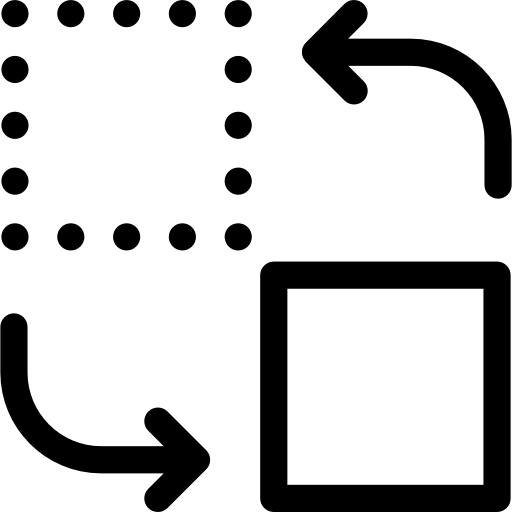

**MZ** 는 다중 화상 채팅 프로그램으로, 자신의 영상을 이동시킬 수 있다는 점이 특징입니다. 

  
## :clock2:개발 기간
24.11.11 ~ 24.12.13

  
## 👨‍👩‍👦‍👦팀원
김시후, 김연경, 김유진, 김한중, 이재용

  
## 🛠개발 환경

  
  
  

## 📃문서 작업

  
  
  
  

# 기능 소개

### ✨시작 화면

1. **서버주소**와 회의에서 사용할 **이름**을 입력합니다.
2. **Enter** 버튼을 입력하여 서버 연결에 성공하면 다음 화면으로 이동합니다.

### 💻회의 화면

#### 카메라 사용
 
| On | Off |
|-----|-----|
|  |  |

1. 화면의 하단에 있는 비디오 이미지를 클릭하여 카메라를 사용 및 중단 합니다.
2. **키보드의 방향키**를 누르거나 **마우스로 드래그**하여 영상 위치를 화면 내에서 **이동**할 수 있습니다.
		
#### 채팅 입력
1. 가장 하단에 있는 채팅 창에 텍스트를 입력하고 **Enter** 키로 텍스트를 전송합니다.
2. 전송된 텍스트는 다른 모든 사용자의 채팅과 함께 회의 화면 좌측 하단에 표시됩니다.

#### 회의 배경 변경

| 교체 버튼 | 추가 버튼 |
|-----|-----|
|  |  |

1. **교체 버튼**을 클릭하여 기본 배경 중에서 원하는 배경을 선택할 수 있습니다.
2. **추가 버튼**을 클릭하여 원하는 이미지 파일을 로컬에서 선택할 수 있습니다.

#### 접속 종료

 빨간색 통화 종료 버튼을 클릭하여 회의를 종료합니다.
